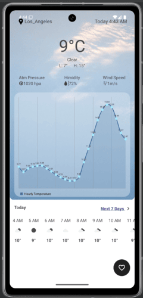
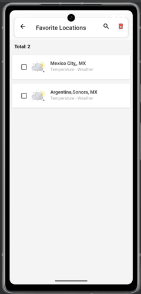
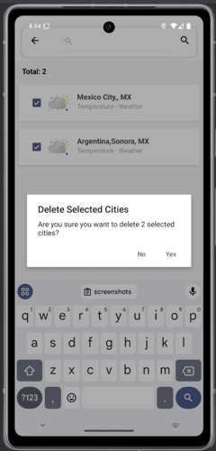
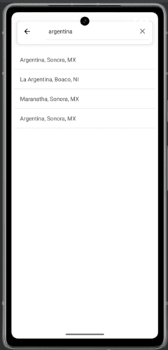
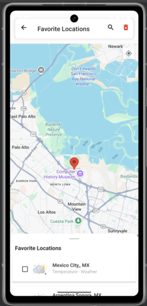

# Farm App

## Overview

WeatherForecast is a basic application designed to demonstrate the principles of clean architecture. 
The app features a well-structured codebase with distinct layers: domain, data, and UI. 
It utilizes Dagger Hilt for dependency injection and Room for local database management as well retrofit for network calls

## Features

- Detailed weather forecast for your current location as well as various analytics
- Search for cities and view their detailed forecasts for the next 7 days
- Add searched cities to your favorites so you can easily have access to them and view their forecasts
- ability to remove cities from your favorites list

## Architecture

The application is structured in three main layers:

1. **Domain Layer**: Contains business logic and application rules. It defines use cases and models.
2. **Data Layer**: Manages data sources, including Room database and any remote data sources.
3. **UI Layer**: Responsible for presenting data to the user and handling user interactions.

## Technologies Used

- **Kotlin**: Programming language for Android development.
- **Dagger Hilt**: Dependency injection framework for Android.
- **Room**: SQLite database for local data storage.
- **Retrofit**: For performing Network calls throughout the app
- **Coroutines**: For asynchronous programming.
- **OpenWeatherMap**: Supplies the data being analyzed on the data or being displayed on the map

## Tests Covered

Tests haven't been covered yet

## Getting Started

### Prerequisites

- Android Studio
- Kotlin SDK
- Gradle

### Installation

1. Clone the repository:
   ```bash
   git clone https://github.com/Jayhymn/WeatherForecast.git


### Screenshots






```
